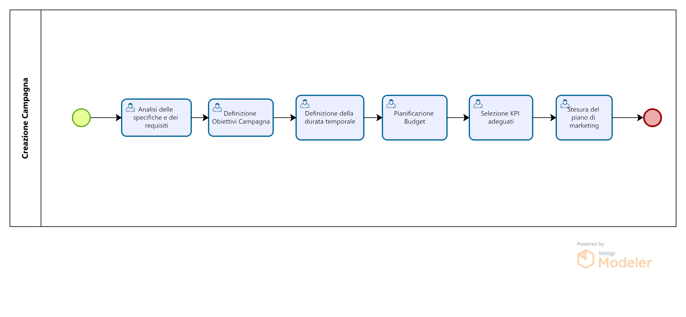
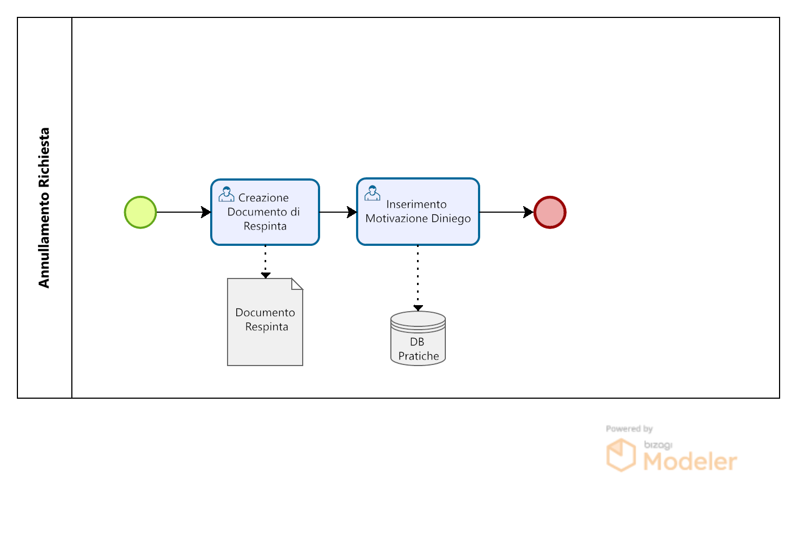
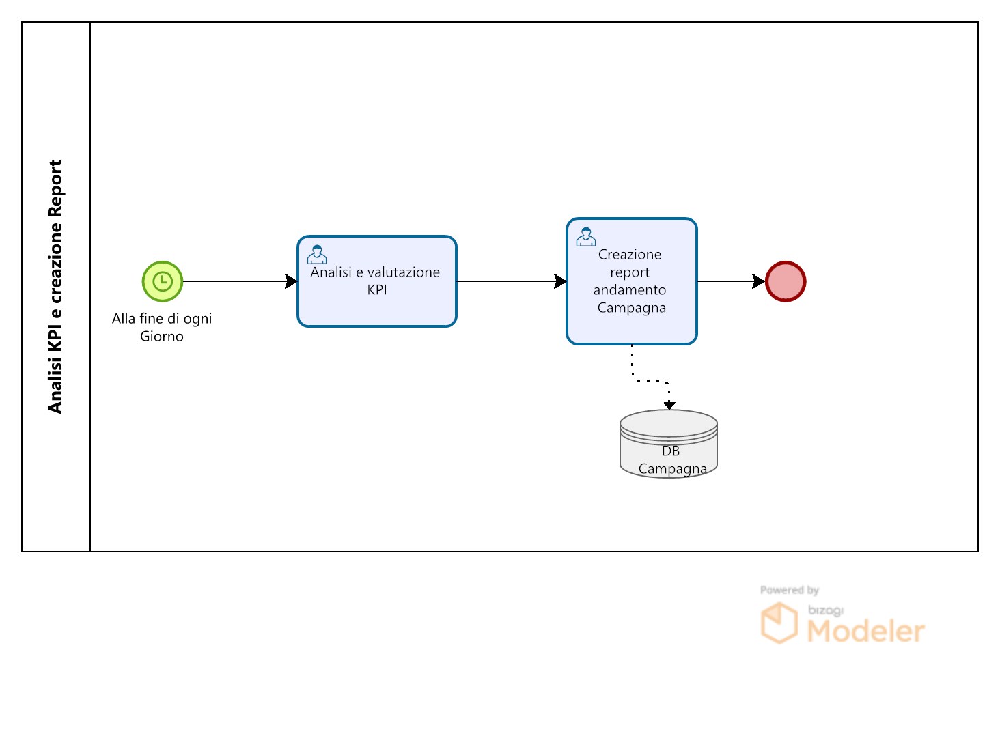
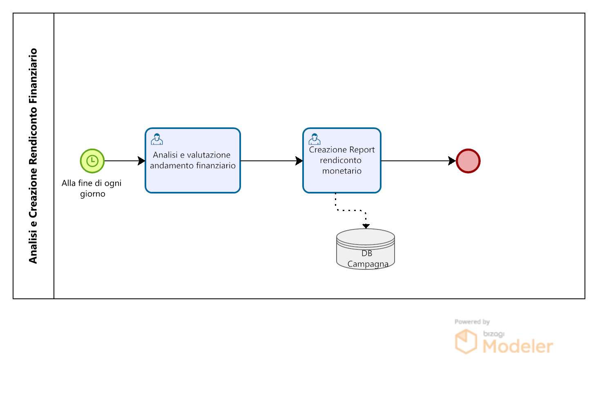

  <h1>📋📌 Design and Modeling of an Online Pinterest Advertising Campaign Management System</h1>

*A business process model for the design and management of online advertising campaigns on Pinterest, developed following a complete BPM methodology from process identification to BPMN 2.0 notation*

[📚 Overview](#-overview) • [🗺️ Process Architecture](#️-process-architecture) • [🔄 Process Models](#-process-models) • [👨‍💻 Authors](#-authors)

---

## 📚 Overview

This project presents the design and modeling of a business process management system for handling online advertising campaigns on Pinterest. The system models the full lifecycle of a sponsored campaign — from its creation and configuration by an advertiser, through review and approval by Pinterest, to performance reporting and financial settlement — using formal BPMN 2.0 notation.

The project was developed as part of the *Gestione dei Processi Aziendali* (Business Process Management) course, Academic Year 2023/2024 — at the University of Salerno. The work follows a complete BPM methodology: process identification, discovery, analysis, redesign, and formal BPMN 2.0 modeling using pools, lanes, message flows, intermediate events, and sub-processes.

---

## 🗺️ Process Architecture

The system is organized around two main participants, modeled as **pools** in BPMN notation: the **Advertiser** (the business entity that creates and manages campaigns) and **Pinterest** (the platform that reviews, activates, and monitors them). Interaction between the two pools is handled through **message flows**, representing the exchange of campaign requests, approval/rejection notifications, performance reports, and financial statements.

The collaboration diagram captures the end-to-end flow: an advertiser submits a campaign creation request, Pinterest reviews it and either approves or rejects it, the campaign runs and generates performance data, and finally a financial report is produced and shared. The process uses **intermediate events**, **exclusive gateways**, and **sub-processes** to handle branching logic such as the rejection handling procedure and report generation.

---

## 🔄 Process Models

The project defines the following BPMN 2.0 process diagrams.

### Main Process

The main collaboration diagram (`ProcessoPrincipale`) models the complete interaction between the Advertiser and Pinterest pools. It covers the full campaign lifecycle: campaign creation request, platform-side review, activation, monitoring, report generation, and financial settlement. The diagram uses message flows to synchronize the two organizational boundaries.

### Campaign Creation

The `CreazioneCampagna` sub-process models the advertiser-side workflow for configuring and submitting a new advertising campaign. It includes setting campaign objectives, budget, duration, target audience, and creative Pin selection before submitting the request to Pinterest for review.

### Rejection Handling

The `PraticaRifiutoRichiesta` sub-process models Pinterest's internal procedure when a submitted campaign does not meet platform guidelines. It covers the notification of the advertiser, the reason for rejection, and the option for the advertiser to revise and resubmit the campaign.

### Report Generation

The `CreazioneReport` sub-process models the generation of campaign performance reports after a campaign ends. It includes data collection, KPI aggregation, and report delivery to the advertiser.

### Financial Statement

The `CreazioneRendicontoFinanziario` sub-process models the financial reconciliation procedure at the end of a campaign. It covers budget consumption calculation, billing generation, and transmission of the financial statement to the advertiser.

---

## 👨‍💻 Authors
- **Asja Antonucci**
- **Mario Berrino**
- **Lorenzo Borrelli**
- **Agostino Cardamone**